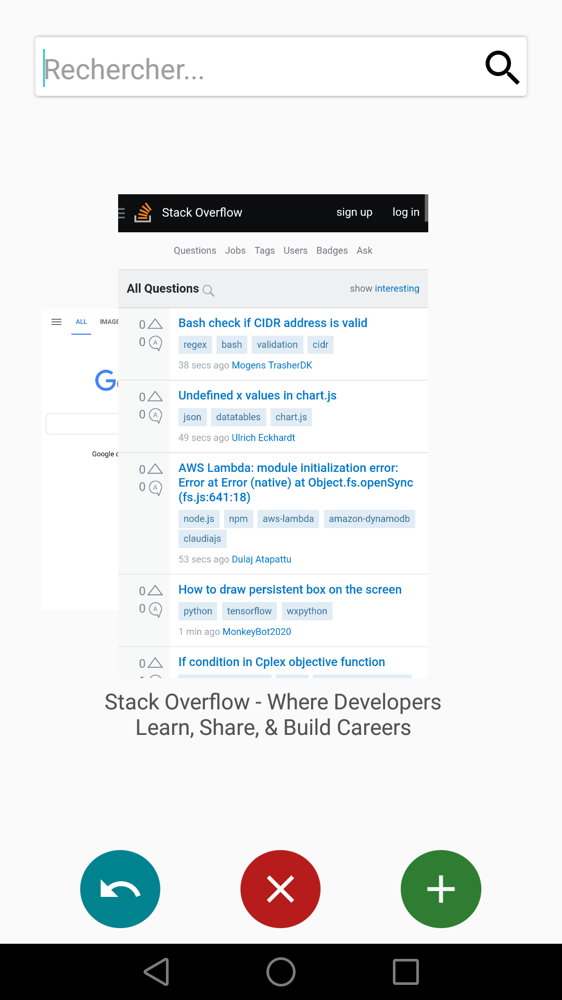
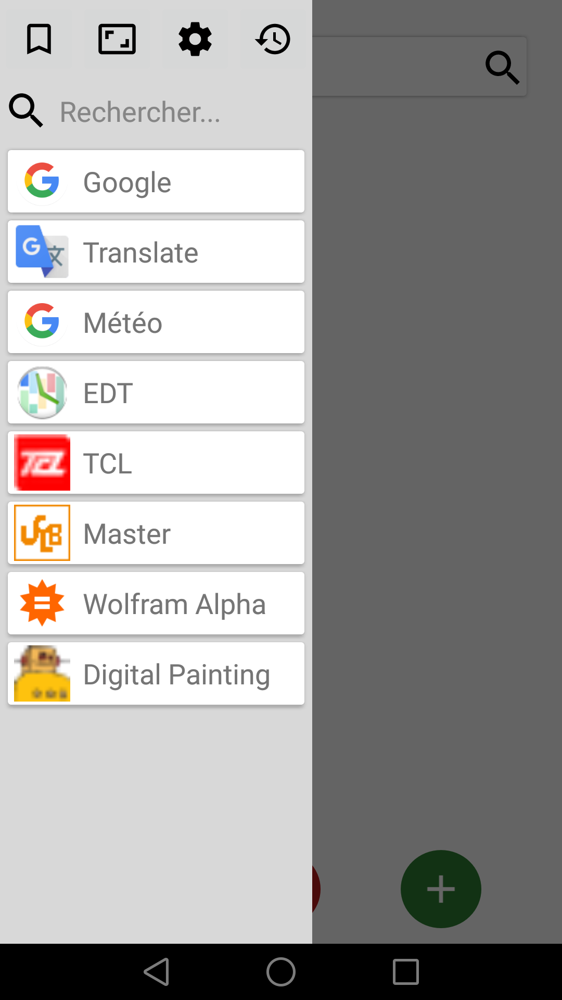
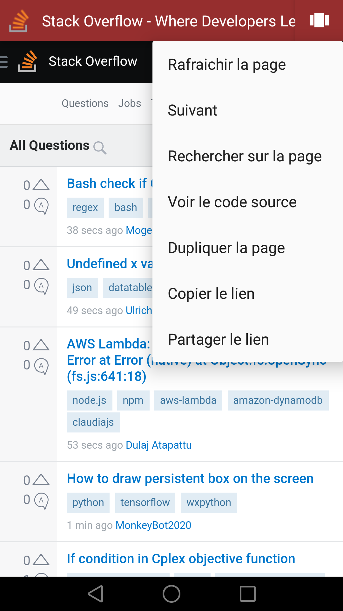

# Browser

      

# Working
* Global navigation
* Ads are hidden
* Changing header bar color
* Bookmarks, history databases
* Smooth animations

# TODO
* Code cleanup (my first android/java project ever, so many complications/repetitions/errors)
* Translations
* Remove ads containers in page (requires some javascript)
* Previews from webpages sometimes not updated
